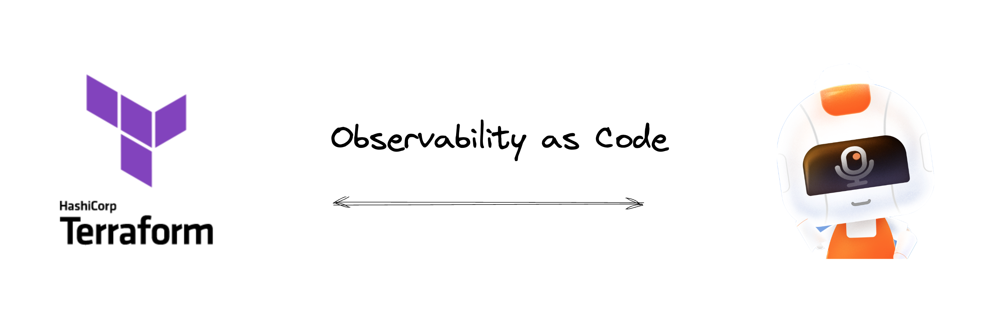

# Terraform Provider: Guance

The Guance Provider provides resources to manage [Guance Cloud](https://en.guance.com/) resources.



## Documentation, questions, and discussions

Official documentation on how to use this provider can be found on the [Terraform Registry](https://registry.terraform.io/providers/GuanceCloud/guance/latest/docs).

The remainder of this document will focus on the development aspects of the provider.

The resource supports as follows:

* [x] notification
* [x] pipeline
* [x] member group
* [x] alert policy
* [x] mute
* [x] black list
* [x] monitor, see built-in modules at [terraform-guance-monitor](https://github.com/GuanceCloud/terraform-guance-monitor)
* [x] dashboard, see built-in modules at [terraform-guance-dashboard](https://github.com/GuanceCloud/terraform-guance-dashboard)

The data source supports as follows:

* [x] members

The region supports as follows:

* [x] hangzhou
* [x] ningxia
* [x] zhangjiakou
* [x] guangzhou
* [x] oregon

If there are more resources you need, create an [issue](https://github.com/GuanceCloud/terraform-provider-guance/issues) for free.

## Compatibility

Compatibility table between this provider, the [Terraform Plugin Protocol](https://www.terraform.io/plugin/how-terraform-works#terraform-plugin-protocol)
version it implements, and Terraform:

| Guance Provider | Terraform Plugin Protocol | Terraform |
|:---------------:|:-------------------------:|:---------:|
|    `>= 0.x`     |            `5`            | `>= 0.12` |

Details can be found by querying the [Registry API](https://www.terraform.io/internals/provider-registry-protocol#list-available-versions)
that return all the details about which versions are currently available for a particular provider.
[Here](https://registry.terraform.io/v1/providers/GuanceCloud/guance/versions) are the details.

## Requirements

* [Terraform](https://www.terraform.io/downloads)
* [Go](https://go.dev/doc/install) (1.19)

## Development

### Testing

Guance Cloud Code Generation Pipeline generates this repository. So don't need to test. Please create issues for free.

### Generating documentation

This provider uses [terraform-plugin-docs](https://github.com/hashicorp/terraform-plugin-docs/)
to generate documentation and store it in the `docs/` directory.
Once a release is cut, the Terraform Registry will download the documentation from `docs/`
and associate it with the release version. Read more about how this works on the
[official page](https://www.terraform.io/registry/providers/docs).

Use `./hack/make gen:doc` to ensure the documentation is regenerated with any changes.

### Using a development build

If [running tests and acceptance tests](#testing) aren't enough, it's possible to set up a local terraform configuration
to use a development build of the provider. This can be achieved by leveraging the Terraform CLI
[configuration file development overrides](https://www.terraform.io/cli/config/config-file#development-overrides-for-provider-developers).

First, use `./hack/make build:install` to place a fresh development build of the provider in your
[`${GOBIN}`](https://pkg.go.dev/cmd/go#hdr-Compile_and_install_packages_and_dependencies)
(defaults to `${GOPATH}/bin` or `${HOME}/go/bin` if `${GOPATH}` is not set). Repeat
this is every time you make changes to the provider locally.

Then, set up your environment following [these instructions](https://www.terraform.io/plugin/debugging#terraform-cli-development-overrides)
to make you're local terraform use your local build.

### Testing GitHub Actions

This project uses [GitHub Actions](https://docs.github.com/en/actions/automating-builds-and-tests) to realize its CI.

Sometimes it might be helpful to reproduce the behavior of those actions locally,
and for this, we use [act](https://github.com/nektos/act). Once installed, you can _simulate_ the actions executed
when opening a PR with:

```shell
# List of workflows for the 'pull_request' action
$ act -l pull_request

# Execute the workflows associated with the `pull_request' action 
$ act pull_request
```

## Releasing

The release process is automated via GitHub Actions, and it's defined in the Workflow
[release.yml](./.github/workflows/release.yml).

Each release is cut by pushing a [semantically versioned](https://semver.org/) tag to the default branch.

## License

[Mozilla Public License v2.0](./LICENSE)
