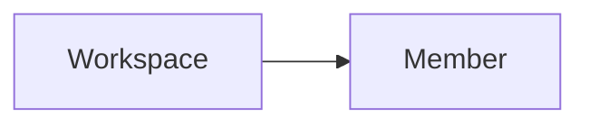

---
# generated by https://github.com/hashicorp/terraform-plugin-docs
page_title: "guance_members Data Source - guance"
subcategory: ""
description: |-
  A workspace member is a user who has access to a workspace.
  Guance Cloud supports managing all members of the current workspace through member management, including setting role permissions, inviting members and setting permissions for members, configuring member groups, and setting SSO single sign-on.
  Relationships:
  mermaid
  graph LR
      A[Workspace] --> B[Member]
  
  Example Usage
  ```terraform
  variable "email" {
    type = string
  }
  data "guance_members" "demo" {
    search = var.email
  }
  output "member" {
    value = data.guance_members.demo.members
  }
  ```
---

# guance_members (Data Source)

A workspace member is a user who has access to a workspace.

Guance Cloud supports managing all members of the current workspace through member management, including setting role permissions, inviting members and setting permissions for members, configuring member groups, and setting SSO single sign-on.

Relationships:



## Example Usage

```terraform
variable "email" {
  type = string
}

data "guance_members" "demo" {
  search = var.email
}

output "member" {
  value = data.guance_members.demo.members
}
```


<!-- schema generated by tfplugindocs -->
## Schema

### Optional

- `search` (String) Search the member by email or name.

### Read-Only

- `members` (Attributes List) The list of the members. (see [below for nested schema](#nestedatt--members))

<a id="nestedatt--members"></a>
### Nested Schema for `members`

Optional:

- `email` (String) Email
- `name` (String) User name
- `roles` (Attributes List) Role, value must be one of: *owner*, *wsAdmin*, *general*, *readOnly*, other value will be ignored. (see [below for nested schema](#nestedatt--members--roles))

Read-Only:

- `create_at` (String) The unix timestamp in seconds of the member creation.
- `uuid` (String) The uuid of the member.

<a id="nestedatt--members--roles"></a>
### Nested Schema for `members.roles`

Optional:

- `name` (String) The name of the role.
- `uuid` (String) The UUID of the role.


