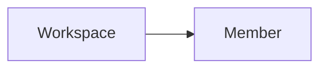

---
# generated by https://github.com/hashicorp/terraform-plugin-docs
page_title: "guance_members Data Source - guance"
subcategory: ""
description: |-
  A workspace member is a user who has access to a workspace.
  Guance Cloud supports managing all members of the current workspace through member management, including setting role permissions, inviting members and setting permissions for members, configuring member groups, and setting SSO single sign-on.
  Relationships:
  mermaid
  graph LR
      A[Workspace] --> B[Member]
---

# guance_members (Data Source)

A workspace member is a user who has access to a workspace.

Guance Cloud supports managing all members of the current workspace through member management, including setting role permissions, inviting members and setting permissions for members, configuring member groups, and setting SSO single sign-on.

Relationships:

<!-- schema generated by tfplugindocs -->
## Schema

### Optional

- `filters` (Attributes List) The list of the resource (see [below for nested schema](#nestedatt--filters))
- `max_results` (Number) The max results count of the resource will be returned.

### Read-Only

- `id` (String) The hasd id of the resource.
- `items` (Attributes List) The list of the resource (see [below for nested schema](#nestedatt--items))

### Nested Schema for `filters`

Required:

- `name` (String) The filter path, represent as json path.
- `values` (List of String) The filter values

### Nested Schema for `items`

Optional:

- `email` (String) Email
- `role` (String) Role, value must be one of: *owner*, *wsAdmin*, *general*, *readOnly*, other value will be ignored.

Read-Only:

- `created_at` (String) The RFC3339/ISO8601 time string of resource created at.
- `id` (String) The Guance Resource Name (GRN) of cloud resource.

