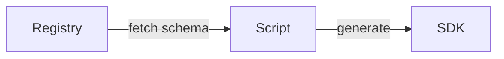

---
# generated by https://github.com/hashicorp/terraform-plugin-docs
page_title: "guance_resourceschemas Data Source - guance"
subcategory: ""
description: |-
  Resource Schema is the core of semantic API. You can discover all the resource by resource schema.
  The typically usage is:
  If you are the third-party vendor, you can create your integration page by schemaIf you need the SDK we haven't published, you can create your own SDK by resource schema
  mermaid
  graph LR
      Registry -- fetch schema --> Script
      Script -- generate --> SDK
---

# guance_resourceschemas (Data Source)

Resource Schema is the core of semantic API. You can discover all the resource by resource schema.

The typically usage is:

* If you are the third-party vendor, you can create your integration page by schema
* If you need the SDK we haven't published, you can create your own SDK by resource schema

<!-- schema generated by tfplugindocs -->
## Schema

### Optional

- `max_results` (Number) The max results count of the resource will be returned.
- `type_name` (String) The type name of the resource be queried

### Read-Only

- `id` (String) Identifier of the resource.
- `items` (Attributes List) The list of the resource (see [below for nested schema](#nestedatt--items))

### Nested Schema for `items`

Required:

- `name` (String) Resource name

Optional:

- `description` (Attributes) Resource description (see [below for nested schema](#nestedatt--items--description))
- `models` (Attributes List) Resource dependends on model (see [below for nested schema](#nestedatt--items--models))
- `title` (Attributes) Resource title (see [below for nested schema](#nestedatt--items--title))

### Nested Schema for `items.description`

Optional:

- `en` (String) English
- `zh` (String) Chinese

### Nested Schema for `items.models`

Required:

- `name` (String) Model name

Optional:

- `description` (Attributes) Model description (see [below for nested schema](#nestedatt--items--models--description))
- `properties` (Attributes List) Model properties (see [below for nested schema](#nestedatt--items--models--properties))
- `title` (Attributes) Model title (see [below for nested schema](#nestedatt--items--models--title))

### Nested Schema for `items.models.description`

Optional:

- `en` (String) English
- `zh` (String) Chinese

### Nested Schema for `items.models.properties`

Required:

- `name` (String) Property name

Optional:

- `description` (Attributes) Property description (see [below for nested schema](#nestedatt--items--models--properties--description))
- `meta` (Attributes) Property meta (see [below for nested schema](#nestedatt--items--models--properties--meta))
- `schema` (Attributes) Property schema (see [below for nested schema](#nestedatt--items--models--properties--schema))
- `title` (Attributes) Property title (see [below for nested schema](#nestedatt--items--models--properties--title))

### Nested Schema for `items.models.properties.title`

Optional:

- `en` (String) English
- `zh` (String) Chinese

### Nested Schema for `items.models.properties.title`

Optional:

- `dynamic` (Boolean) Property is dynamic
- `immutable` (Boolean) Property is immutable

### Nested Schema for `items.models.properties.title`

Required:

- `type` (String) Property type

Optional:

- `elem` (Attributes) Property element schema (see [below for nested schema](#nestedatt--items--models--properties--title--elem))
- `enum` (Attributes List) Property enum (see [below for nested schema](#nestedatt--items--models--properties--title--enum))
- `format` (String) Property format
- `model` (String) Property reference model
- `ref` (String) Property reference resource
- `required` (Boolean) Property is required

### Nested Schema for `items.models.properties.title.elem`

Required:

- `type` (String) Element type

Optional:

- `enum` (Attributes List) Element enum (see [below for nested schema](#nestedatt--items--models--properties--title--elem--enum))
- `format` (String) Element format
- `ref` (String) Element reference model

### Nested Schema for `items.models.properties.title.elem.ref`

Required:

- `name` (String) Enum name
- `value` (String) Enum value

Optional:

- `title` (Attributes) Enum title (see [below for nested schema](#nestedatt--items--models--properties--title--elem--ref--title))

### Nested Schema for `items.models.properties.title.elem.ref.title`

Optional:

- `en` (String) English
- `zh` (String) Chinese

### Nested Schema for `items.models.properties.title.enum`

Required:

- `name` (String) Enum name
- `value` (String) Enum value

Optional:

- `title` (Attributes) Enum title (see [below for nested schema](#nestedatt--items--models--properties--title--enum--title))

### Nested Schema for `items.models.properties.title.enum.title`

Optional:

- `en` (String) English
- `zh` (String) Chinese

### Nested Schema for `items.models.properties.title`

Optional:

- `en` (String) English
- `zh` (String) Chinese

### Nested Schema for `items.models.title`

Optional:

- `en` (String) English
- `zh` (String) Chinese

### Nested Schema for `items.title`

Optional:

- `en` (String) English
- `zh` (String) Chinese

