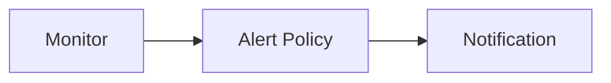

---
# generated by https://github.com/hashicorp/terraform-plugin-docs
page_title: "guance_alertpolicy Resource - guance"
subcategory: ""
description: |-
  Alert policy is a set of rules that define when to trigger an alert. You can create alert policies for your data sources, and set up alert targets to receive alerts.
  Guance Cloud supports alert policy management for the results of monitor checks, by sending alert notification emails or group message notifications, so that you can know about the abnormal data situation of the monitoring in time, find problems, and solve problems.
  Relationships:
  ```mermaid
  graph LR
  A[Monitor] --> B[Alert Policy] --> C[Notification]
  ```
  Notes:
  When a monitor is created, an alert policy must be selected, and the default is selected by default;When a certain alert policy is deleted, the monitor under the deleted alert policy will automatically be classified into the default.
---

# guance_alertpolicy (Resource)

Alert policy is a set of rules that define when to trigger an alert. You can create alert policies for your data sources, and set up alert targets to receive alerts.

Guance Cloud supports alert policy management for the results of monitor checks, by sending alert notification emails or group message notifications, so that you can know about the abnormal data situation of the monitoring in time, find problems, and solve problems.

Relationships:



Notes:

1. When a monitor is created, an alert policy must be selected, and the default is selected by default;
2. When a certain alert policy is deleted, the monitor under the deleted alert policy will automatically be classified into the default.


<!-- schema generated by tfplugindocs -->
## Schema

### Required

- `name` (String) Alert Policy Name

### Optional

- `alert_target` (Attributes List) Alert Action (see [below for nested schema](#nestedatt--alert_target))
- `silent_timeout` (Number) Silent timeout timestamp
- `type` (String) Trigger rule type, default is custom

### Read-Only

- `created_at` (String) Timestamp of the last Terraform update of the order.
- `id` (String) Numeric identifier of the order.

<a id="nestedatt--alert_target"></a>
### Nested Schema for `alert_target`

Required:

- `status` (List of String) The status value of the event to be sent
- `type` (String) Alert type

Optional:

- `allow_week_days` (List of Number) Allowed to send alerts on weekdays
- `min_interval` (Number) The minimum alert interval, in seconds. 0 / null means always send an alert
- `notification` (Attributes) Notification (see [below for nested schema](#nestedatt--alert_target--notification))

<a id="nestedatt--alert_target--notification"></a>
### Nested Schema for `alert_target.notification`

Required:

- `to` (List of String) Notification


