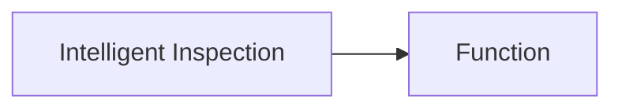

---
# generated by https://github.com/hashicorp/terraform-plugin-docs
page_title: "guance_intelligentinspection Resource - guance"
subcategory: ""
description: |-
  Intelligent inspection is a feature that allows you to automatically detect abnormality in the system and trigger alarms. It is based on the concept of anomaly detection, which is a time series analysis technique that can detect anomalies in the system based on historical data.
  Guance Cloud supports custom intelligent inspection through Function. Based on intelligent algorithms, it automatically detects infrastructure and application problems to help users find problems that have already occurred and potential problems in the process of IT system operation. Through root cause analysis, it can quickly locate the cause of abnormal problems.
  Relationships:
  mermaid
  graph LR
      A[Intelligent Inspection] --> B[Function]
---

# guance_intelligentinspection (Resource)

Intelligent inspection is a feature that allows you to automatically detect abnormality in the system and trigger alarms. It is based on the concept of anomaly detection, which is a time series analysis technique that can detect anomalies in the system based on historical data.

Guance Cloud supports custom intelligent inspection through Function. Based on intelligent algorithms, it automatically detects infrastructure and application problems to help users find problems that have already occurred and potential problems in the process of IT system operation. Through root cause analysis, it can quickly locate the cause of abnormal problems.

Relationships:

<!-- schema generated by tfplugindocs -->
## Schema

### Optional

- `monitor_id` (String) Monitor ID
- `ref_func` (Attributes) Ref Func Info (see [below for nested schema](#nestedatt--ref_func))
- `ref_key` (String) Ref Key

### Read-Only

- `created_at` (String) Timestamp of the last Terraform update of the order.
- `id` (String) Numeric identifier of the order.

### Nested Schema for `ref_func`

Optional:

- `args` (List of String) Args
- `category` (String) Category
- `definition` (String) Definition
- `description` (String) Description
- `disabled` (Boolean) Is Disabled
- `func_id` (String) Func ID
- `kwargs` (String) Kwargs
- `title` (String) Title

