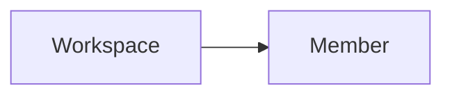

---
# generated by https://github.com/hashicorp/terraform-plugin-docs
page_title: "guance_member Resource - guance"
subcategory: ""
description: |-
  A workspace member is a user who has access to a workspace.
  Guance Cloud supports managing all members of the current workspace through member management, including setting role permissions, inviting members and setting permissions for members, configuring member groups, and setting SSO single sign-on.
  Relationships:
  mermaid
  graph LR
      A[Workspace] --> B[Member]
---

# guance_member (Resource)

A workspace member is a user who has access to a workspace.

Guance Cloud supports managing all members of the current workspace through member management, including setting role permissions, inviting members and setting permissions for members, configuring member groups, and setting SSO single sign-on.

Relationships:

<!-- schema generated by tfplugindocs -->
## Schema

### Required

- `workspace_id` (String) Workspace ID

### Optional

- `email` (String) Email
- `mobile` (String) Mobile
- `name` (String) Name
- `role` (String) Role
- `username` (String) Username

### Read-Only

- `created_at` (String) Timestamp of the last Terraform update of the order.
- `id` (String) Numeric identifier of the order.

