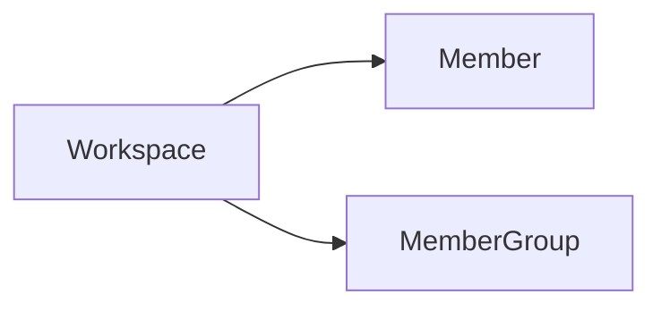

---
# generated by https://github.com/hashicorp/terraform-plugin-docs
page_title: "guance_membergroup Resource - guance"
subcategory: ""
description: |-
  Member group is a collection of members in a workspace, and member groups can be authorized to access the resources in the workspace.
  Member group is an abstract concept, it can be a team, or a department, it can help us build a reasonable organizational structure, optimize the management efficiency and user experience of the observability platform.
  Relationships:
  ```mermaid
  graph LR
  A[Workspace] --> B[Member]
  A --> C[MemberGroup]
  ```
---

# guance_membergroup (Resource)

Member group is a collection of members in a workspace, and member groups can be authorized to access the resources in the workspace.

Member group is an abstract concept, it can be a team, or a department, it can help us build a reasonable organizational structure, optimize the management efficiency and user experience of the observability platform.

Relationships:




<!-- schema generated by tfplugindocs -->
## Schema

### Required

- `name` (String) Name

### Optional

- `member_ids` (List of String) Member id list

### Read-Only

- `created_at` (String) Timestamp of the last Terraform update of the order.
- `id` (String) Numeric identifier of the order.


