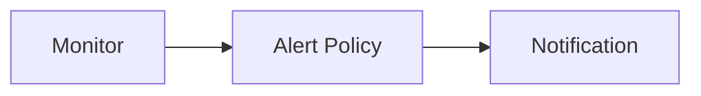

---
# generated by https://github.com/hashicorp/terraform-plugin-docs
page_title: "guance_monitor Resource - guance"
subcategory: ""
description: |-
  Monitor
  WORKING IN PROGRESS
  A monitor is a set of checks that you can run against your data. A monitor watches your data over time and alerts you when certain conditions are met. For example, you can create a monitor that watches the average response time of your website and alerts you when the response time is greater than 1 second.
  Monitors are made up of one or more checks. A check is a single test that you can run against your data. For example, you can create a check that watches the average response time of your website. You can also create a check that watches the percentage of 5xx errors in your logs.
  Guance Cloud supports defining monitors, users can customize the configuration of detection rules and trigger conditions, and open the monitors to receive related alarm events triggered by the detection rules.
  Relationships:
  ```mermaid
  graph LR
  A[Monitor] --> B[Alert Policy] --> C[Notification]
  ```
  Create
  The first let me create a resource. We will send the create operation to the resource management service
  terraform
  resource "guance_monitor" "demo" {
      name        = "oac-demo"
  }
---

# guance_monitor (Resource)

# Monitor

**WORKING IN PROGRESS**

A monitor is a set of checks that you can run against your data. A monitor watches your data over time and alerts you when certain conditions are met. For example, you can create a monitor that watches the average response time of your website and alerts you when the response time is greater than 1 second.

Monitors are made up of one or more checks. A check is a single test that you can run against your data. For example, you can create a check that watches the average response time of your website. You can also create a check that watches the percentage of 5xx errors in your logs.

Guance Cloud supports defining monitors, users can customize the configuration of detection rules and trigger conditions, and open the monitors to receive related alarm events triggered by the detection rules.

Relationships:



## Create

The first let me create a resource. We will send the create operation to the resource management service

```terraform
resource "guance_monitor" "demo" {
	name        = "oac-demo"
}
```


<!-- schema generated by tfplugindocs -->
## Schema

### Optional

- `dashboard_id` (String) <no value>
- `script` (Attributes) <no value> (see [below for nested schema](#nestedatt--script))

### Read-Only

- `created_at` (String) Timestamp of the last Terraform update of the order.
- `id` (String) Numeric identifier of the order.

<a id="nestedatt--script"></a>
### Nested Schema for `script`

Optional:

- `apm_check` (Attributes) APM check (see [below for nested schema](#nestedatt--script--apm_check))
- `cloud_dial_check` (Attributes) cloud dial check (see [below for nested schema](#nestedatt--script--cloud_dial_check))
- `logging_check` (Attributes) logging check (see [below for nested schema](#nestedatt--script--logging_check))
- `mutations_check` (Attributes) mutations check (see [below for nested schema](#nestedatt--script--mutations_check))
- `process_check` (Attributes) process check (see [below for nested schema](#nestedatt--script--process_check))
- `range_check` (Attributes) range check (see [below for nested schema](#nestedatt--script--range_check))
- `rum_check` (Attributes) RUM check (see [below for nested schema](#nestedatt--script--rum_check))
- `security_check` (Attributes) security check (see [below for nested schema](#nestedatt--script--security_check))
- `senior_check` (Attributes) senior check (see [below for nested schema](#nestedatt--script--senior_check))
- `simple_check` (Attributes) simple check (see [below for nested schema](#nestedatt--script--simple_check))
- `type` (String) check method type
- `water_level_check` (Attributes) water level check (see [below for nested schema](#nestedatt--script--water_level_check))

<a id="nestedatt--script--apm_check"></a>
### Nested Schema for `script.apm_check`

Optional:

- `checker` (Attributes) condition configuration for checking (see [below for nested schema](#nestedatt--script--apm_check--checker))
- `every` (String) check frequency
- `interval` (Number) Query interval
- `message` (String) event message
- `name` (String) check item name
- `no_data_interval` (Number) no data interval
- `recover_need_period_count` (Number) recover need period count
- `targets` (Attributes List) targets for checking (see [below for nested schema](#nestedatt--script--apm_check--targets))
- `title` (String) event title

<a id="nestedatt--script--apm_check--checker"></a>
### Nested Schema for `script.apm_check.checker`

Optional:

- `rules` (Attributes List) rules (see [below for nested schema](#nestedatt--script--apm_check--checker--rules))

<a id="nestedatt--script--apm_check--checker--rules"></a>
### Nested Schema for `script.apm_check.checker.rules`

Optional:

- `check_count` (Number) [water level/mutation parameter] continuous abnormal point number
- `check_percent` (Number) [interval parameter] abnormal percentage threshold
- `condition_logic` (String) condition logic
- `conditions` (Attributes List) conditions (see [below for nested schema](#nestedatt--script--apm_check--checker--rules--conditions))
- `direction` (String) [interval/water level/mutation parameter] check direction
- `period_num` (Number) [interval/water level/mutation parameter] only check the latest data point number
- `status` (String) Fit the condition, the output event's status. The value is the same as the event's status
- `strength` (Number) [water level/mutation parameter] strength

<a id="nestedatt--script--apm_check--checker--rules--conditions"></a>
### Nested Schema for `script.apm_check.checker.rules.conditions`

Optional:

- `alias` (String) alias of target
- `operands` (List of String) operands
- `operator` (String) operator


<a id="nestedatt--script--apm_check--targets"></a>
### Nested Schema for `script.apm_check.targets`

Optional:

- `alias` (String) alias
- `dql` (String) dql


<a id="nestedatt--script--cloud_dial_check"></a>
### Nested Schema for `script.cloud_dial_check`

Optional:

- `checker` (Attributes) condition configuration for checking (see [below for nested schema](#nestedatt--script--cloud_dial_check--checker))
- `every` (String) check frequency
- `interval` (Number) Query interval
- `message` (String) event message
- `name` (String) check item name
- `no_data_interval` (Number) no data interval
- `recover_need_period_count` (Number) recover need period count
- `targets` (Attributes List) targets for checking (see [below for nested schema](#nestedatt--script--cloud_dial_check--targets))
- `title` (String) event title

<a id="nestedatt--script--cloud_dial_check--checker"></a>
### Nested Schema for `script.cloud_dial_check.checker`

Optional:

- `rules` (Attributes List) rules (see [below for nested schema](#nestedatt--script--cloud_dial_check--checker--rules))

<a id="nestedatt--script--cloud_dial_check--checker--rules"></a>
### Nested Schema for `script.cloud_dial_check.checker.rules`

Optional:

- `check_count` (Number) [water level/mutation parameter] continuous abnormal point number
- `check_percent` (Number) [interval parameter] abnormal percentage threshold
- `condition_logic` (String) condition logic
- `conditions` (Attributes List) conditions (see [below for nested schema](#nestedatt--script--cloud_dial_check--checker--rules--conditions))
- `direction` (String) [interval/water level/mutation parameter] check direction
- `period_num` (Number) [interval/water level/mutation parameter] only check the latest data point number
- `status` (String) Fit the condition, the output event's status. The value is the same as the event's status
- `strength` (Number) [water level/mutation parameter] strength

<a id="nestedatt--script--cloud_dial_check--checker--rules--conditions"></a>
### Nested Schema for `script.cloud_dial_check.checker.rules.conditions`

Optional:

- `alias` (String) alias of target
- `operands` (List of String) operands
- `operator` (String) operator


<a id="nestedatt--script--cloud_dial_check--targets"></a>
### Nested Schema for `script.cloud_dial_check.targets`

Optional:

- `alias` (String) alias
- `dql` (String) dql


<a id="nestedatt--script--logging_check"></a>
### Nested Schema for `script.logging_check`

Optional:

- `checker` (Attributes) condition configuration for checking (see [below for nested schema](#nestedatt--script--logging_check--checker))
- `every` (String) check frequency
- `interval` (Number) Query interval
- `message` (String) event message
- `name` (String) check item name
- `no_data_interval` (Number) no data interval
- `recover_need_period_count` (Number) recover need period count
- `targets` (Attributes List) targets for checking (see [below for nested schema](#nestedatt--script--logging_check--targets))
- `title` (String) event title

<a id="nestedatt--script--logging_check--checker"></a>
### Nested Schema for `script.logging_check.checker`

Optional:

- `rules` (Attributes List) rules (see [below for nested schema](#nestedatt--script--logging_check--checker--rules))

<a id="nestedatt--script--logging_check--checker--rules"></a>
### Nested Schema for `script.logging_check.checker.rules`

Optional:

- `check_count` (Number) [water level/mutation parameter] continuous abnormal point number
- `check_percent` (Number) [interval parameter] abnormal percentage threshold
- `condition_logic` (String) condition logic
- `conditions` (Attributes List) conditions (see [below for nested schema](#nestedatt--script--logging_check--checker--rules--conditions))
- `direction` (String) [interval/water level/mutation parameter] check direction
- `period_num` (Number) [interval/water level/mutation parameter] only check the latest data point number
- `status` (String) Fit the condition, the output event's status. The value is the same as the event's status
- `strength` (Number) [water level/mutation parameter] strength

<a id="nestedatt--script--logging_check--checker--rules--conditions"></a>
### Nested Schema for `script.logging_check.checker.rules.conditions`

Optional:

- `alias` (String) alias of target
- `operands` (List of String) operands
- `operator` (String) operator


<a id="nestedatt--script--logging_check--targets"></a>
### Nested Schema for `script.logging_check.targets`

Optional:

- `alias` (String) alias
- `dql` (String) dql


<a id="nestedatt--script--mutations_check"></a>
### Nested Schema for `script.mutations_check`

Optional:

- `checker` (Attributes) condition configuration for checking (see [below for nested schema](#nestedatt--script--mutations_check--checker))
- `every` (String) check frequency
- `interval` (Number) Query interval
- `message` (String) event message
- `name` (String) check item name
- `no_data_interval` (Number) no data interval
- `recover_need_period_count` (Number) recover need period count
- `targets` (Attributes List) targets for checking (see [below for nested schema](#nestedatt--script--mutations_check--targets))
- `title` (String) event title

<a id="nestedatt--script--mutations_check--checker"></a>
### Nested Schema for `script.mutations_check.checker`

Optional:

- `rules` (Attributes List) rules (see [below for nested schema](#nestedatt--script--mutations_check--checker--rules))

<a id="nestedatt--script--mutations_check--checker--rules"></a>
### Nested Schema for `script.mutations_check.checker.rules`

Optional:

- `check_count` (Number) [water level/mutation parameter] continuous abnormal point number
- `check_percent` (Number) [interval parameter] abnormal percentage threshold
- `condition_logic` (String) condition logic
- `conditions` (Attributes List) conditions (see [below for nested schema](#nestedatt--script--mutations_check--checker--rules--conditions))
- `direction` (String) [interval/water level/mutation parameter] check direction
- `period_num` (Number) [interval/water level/mutation parameter] only check the latest data point number
- `status` (String) Fit the condition, the output event's status. The value is the same as the event's status
- `strength` (Number) [water level/mutation parameter] strength

<a id="nestedatt--script--mutations_check--checker--rules--conditions"></a>
### Nested Schema for `script.mutations_check.checker.rules.conditions`

Optional:

- `alias` (String) alias of target
- `operands` (List of String) operands
- `operator` (String) operator


<a id="nestedatt--script--mutations_check--targets"></a>
### Nested Schema for `script.mutations_check.targets`

Optional:

- `alias` (String) alias
- `dql` (String) dql


<a id="nestedatt--script--process_check"></a>
### Nested Schema for `script.process_check`

Optional:

- `checker` (Attributes) condition configuration for checking (see [below for nested schema](#nestedatt--script--process_check--checker))
- `every` (String) check frequency
- `interval` (Number) Query interval
- `message` (String) event message
- `name` (String) check item name
- `no_data_interval` (Number) no data interval
- `recover_need_period_count` (Number) recover need period count
- `targets` (Attributes List) targets for checking (see [below for nested schema](#nestedatt--script--process_check--targets))
- `title` (String) event title

<a id="nestedatt--script--process_check--checker"></a>
### Nested Schema for `script.process_check.checker`

Optional:

- `rules` (Attributes List) rules (see [below for nested schema](#nestedatt--script--process_check--checker--rules))

<a id="nestedatt--script--process_check--checker--rules"></a>
### Nested Schema for `script.process_check.checker.rules`

Optional:

- `check_count` (Number) [water level/mutation parameter] continuous abnormal point number
- `check_percent` (Number) [interval parameter] abnormal percentage threshold
- `condition_logic` (String) condition logic
- `conditions` (Attributes List) conditions (see [below for nested schema](#nestedatt--script--process_check--checker--rules--conditions))
- `direction` (String) [interval/water level/mutation parameter] check direction
- `period_num` (Number) [interval/water level/mutation parameter] only check the latest data point number
- `status` (String) Fit the condition, the output event's status. The value is the same as the event's status
- `strength` (Number) [water level/mutation parameter] strength

<a id="nestedatt--script--process_check--checker--rules--conditions"></a>
### Nested Schema for `script.process_check.checker.rules.conditions`

Optional:

- `alias` (String) alias of target
- `operands` (List of String) operands
- `operator` (String) operator


<a id="nestedatt--script--process_check--targets"></a>
### Nested Schema for `script.process_check.targets`

Optional:

- `alias` (String) alias
- `dql` (String) dql


<a id="nestedatt--script--range_check"></a>
### Nested Schema for `script.range_check`

Optional:

- `checker` (Attributes) condition configuration for checking (see [below for nested schema](#nestedatt--script--range_check--checker))
- `every` (String) check frequency
- `interval` (Number) Query interval
- `message` (String) event message
- `name` (String) check item name
- `no_data_interval` (Number) no data interval
- `recover_need_period_count` (Number) recover need period count
- `targets` (Attributes List) targets for checking (see [below for nested schema](#nestedatt--script--range_check--targets))
- `title` (String) event title

<a id="nestedatt--script--range_check--checker"></a>
### Nested Schema for `script.range_check.checker`

Optional:

- `rules` (Attributes List) rules (see [below for nested schema](#nestedatt--script--range_check--checker--rules))

<a id="nestedatt--script--range_check--checker--rules"></a>
### Nested Schema for `script.range_check.checker.rules`

Optional:

- `check_count` (Number) [water level/mutation parameter] continuous abnormal point number
- `check_percent` (Number) [interval parameter] abnormal percentage threshold
- `condition_logic` (String) condition logic
- `conditions` (Attributes List) conditions (see [below for nested schema](#nestedatt--script--range_check--checker--rules--conditions))
- `direction` (String) [interval/water level/mutation parameter] check direction
- `period_num` (Number) [interval/water level/mutation parameter] only check the latest data point number
- `status` (String) Fit the condition, the output event's status. The value is the same as the event's status
- `strength` (Number) [water level/mutation parameter] strength

<a id="nestedatt--script--range_check--checker--rules--conditions"></a>
### Nested Schema for `script.range_check.checker.rules.conditions`

Optional:

- `alias` (String) alias of target
- `operands` (List of String) operands
- `operator` (String) operator


<a id="nestedatt--script--range_check--targets"></a>
### Nested Schema for `script.range_check.targets`

Optional:

- `alias` (String) alias
- `dql` (String) dql


<a id="nestedatt--script--rum_check"></a>
### Nested Schema for `script.rum_check`

Optional:

- `checker` (Attributes) condition configuration for checking (see [below for nested schema](#nestedatt--script--rum_check--checker))
- `every` (String) check frequency
- `interval` (Number) Query interval
- `message` (String) event message
- `name` (String) check item name
- `no_data_interval` (Number) no data interval
- `recover_need_period_count` (Number) recover need period count
- `targets` (Attributes List) targets for checking (see [below for nested schema](#nestedatt--script--rum_check--targets))
- `title` (String) event title

<a id="nestedatt--script--rum_check--checker"></a>
### Nested Schema for `script.rum_check.checker`

Optional:

- `rules` (Attributes List) rules (see [below for nested schema](#nestedatt--script--rum_check--checker--rules))

<a id="nestedatt--script--rum_check--checker--rules"></a>
### Nested Schema for `script.rum_check.checker.rules`

Optional:

- `check_count` (Number) [water level/mutation parameter] continuous abnormal point number
- `check_percent` (Number) [interval parameter] abnormal percentage threshold
- `condition_logic` (String) condition logic
- `conditions` (Attributes List) conditions (see [below for nested schema](#nestedatt--script--rum_check--checker--rules--conditions))
- `direction` (String) [interval/water level/mutation parameter] check direction
- `period_num` (Number) [interval/water level/mutation parameter] only check the latest data point number
- `status` (String) Fit the condition, the output event's status. The value is the same as the event's status
- `strength` (Number) [water level/mutation parameter] strength

<a id="nestedatt--script--rum_check--checker--rules--conditions"></a>
### Nested Schema for `script.rum_check.checker.rules.conditions`

Optional:

- `alias` (String) alias of target
- `operands` (List of String) operands
- `operator` (String) operator


<a id="nestedatt--script--rum_check--targets"></a>
### Nested Schema for `script.rum_check.targets`

Optional:

- `alias` (String) alias
- `dql` (String) dql


<a id="nestedatt--script--security_check"></a>
### Nested Schema for `script.security_check`

Optional:

- `checker` (Attributes) condition configuration for checking (see [below for nested schema](#nestedatt--script--security_check--checker))
- `every` (String) check frequency
- `interval` (Number) Query interval
- `message` (String) event message
- `name` (String) check item name
- `no_data_interval` (Number) no data interval
- `recover_need_period_count` (Number) recover need period count
- `targets` (Attributes List) targets for checking (see [below for nested schema](#nestedatt--script--security_check--targets))
- `title` (String) event title

<a id="nestedatt--script--security_check--checker"></a>
### Nested Schema for `script.security_check.checker`

Optional:

- `rules` (Attributes List) rules (see [below for nested schema](#nestedatt--script--security_check--checker--rules))

<a id="nestedatt--script--security_check--checker--rules"></a>
### Nested Schema for `script.security_check.checker.rules`

Optional:

- `check_count` (Number) [water level/mutation parameter] continuous abnormal point number
- `check_percent` (Number) [interval parameter] abnormal percentage threshold
- `condition_logic` (String) condition logic
- `conditions` (Attributes List) conditions (see [below for nested schema](#nestedatt--script--security_check--checker--rules--conditions))
- `direction` (String) [interval/water level/mutation parameter] check direction
- `period_num` (Number) [interval/water level/mutation parameter] only check the latest data point number
- `status` (String) Fit the condition, the output event's status. The value is the same as the event's status
- `strength` (Number) [water level/mutation parameter] strength

<a id="nestedatt--script--security_check--checker--rules--conditions"></a>
### Nested Schema for `script.security_check.checker.rules.conditions`

Optional:

- `alias` (String) alias of target
- `operands` (List of String) operands
- `operator` (String) operator


<a id="nestedatt--script--security_check--targets"></a>
### Nested Schema for `script.security_check.targets`

Optional:

- `alias` (String) alias
- `dql` (String) dql


<a id="nestedatt--script--senior_check"></a>
### Nested Schema for `script.senior_check`

Required:

- `check_funcs` (Attributes List) check functions (see [below for nested schema](#nestedatt--script--senior_check--check_funcs))
- `every` (String) check frequency
- `message` (String) event message
- `name` (String) rule name
- `title` (String) event title
- `type` (String) rule type

<a id="nestedatt--script--senior_check--check_funcs"></a>
### Nested Schema for `script.senior_check.check_funcs`

Required:

- `func_id` (String) function ID

Optional:

- `kwargs` (String) parameters


<a id="nestedatt--script--simple_check"></a>
### Nested Schema for `script.simple_check`

Optional:

- `checker` (Attributes) condition configuration for checking (see [below for nested schema](#nestedatt--script--simple_check--checker))
- `every` (String) check frequency
- `interval` (Number) Query interval
- `message` (String) event message
- `name` (String) check item name
- `no_data_interval` (Number) no data interval
- `recover_need_period_count` (Number) recover need period count
- `targets` (Attributes List) targets for checking (see [below for nested schema](#nestedatt--script--simple_check--targets))
- `title` (String) event title

<a id="nestedatt--script--simple_check--checker"></a>
### Nested Schema for `script.simple_check.checker`

Optional:

- `rules` (Attributes List) rules (see [below for nested schema](#nestedatt--script--simple_check--checker--rules))

<a id="nestedatt--script--simple_check--checker--rules"></a>
### Nested Schema for `script.simple_check.checker.rules`

Optional:

- `check_count` (Number) [water level/mutation parameter] continuous abnormal point number
- `check_percent` (Number) [interval parameter] abnormal percentage threshold
- `condition_logic` (String) condition logic
- `conditions` (Attributes List) conditions (see [below for nested schema](#nestedatt--script--simple_check--checker--rules--conditions))
- `direction` (String) [interval/water level/mutation parameter] check direction
- `period_num` (Number) [interval/water level/mutation parameter] only check the latest data point number
- `status` (String) Fit the condition, the output event's status. The value is the same as the event's status
- `strength` (Number) [water level/mutation parameter] strength

<a id="nestedatt--script--simple_check--checker--rules--conditions"></a>
### Nested Schema for `script.simple_check.checker.rules.conditions`

Optional:

- `alias` (String) alias of target
- `operands` (List of String) operands
- `operator` (String) operator


<a id="nestedatt--script--simple_check--targets"></a>
### Nested Schema for `script.simple_check.targets`

Optional:

- `alias` (String) alias
- `dql` (String) dql


<a id="nestedatt--script--water_level_check"></a>
### Nested Schema for `script.water_level_check`

Optional:

- `checker` (Attributes) condition configuration for checking (see [below for nested schema](#nestedatt--script--water_level_check--checker))
- `every` (String) check frequency
- `interval` (Number) Query interval
- `message` (String) event message
- `name` (String) check item name
- `no_data_interval` (Number) no data interval
- `recover_need_period_count` (Number) recover need period count
- `targets` (Attributes List) targets for checking (see [below for nested schema](#nestedatt--script--water_level_check--targets))
- `title` (String) event title

<a id="nestedatt--script--water_level_check--checker"></a>
### Nested Schema for `script.water_level_check.checker`

Optional:

- `rules` (Attributes List) rules (see [below for nested schema](#nestedatt--script--water_level_check--checker--rules))

<a id="nestedatt--script--water_level_check--checker--rules"></a>
### Nested Schema for `script.water_level_check.checker.rules`

Optional:

- `check_count` (Number) [water level/mutation parameter] continuous abnormal point number
- `check_percent` (Number) [interval parameter] abnormal percentage threshold
- `condition_logic` (String) condition logic
- `conditions` (Attributes List) conditions (see [below for nested schema](#nestedatt--script--water_level_check--checker--rules--conditions))
- `direction` (String) [interval/water level/mutation parameter] check direction
- `period_num` (Number) [interval/water level/mutation parameter] only check the latest data point number
- `status` (String) Fit the condition, the output event's status. The value is the same as the event's status
- `strength` (Number) [water level/mutation parameter] strength

<a id="nestedatt--script--water_level_check--checker--rules--conditions"></a>
### Nested Schema for `script.water_level_check.checker.rules.conditions`

Optional:

- `alias` (String) alias of target
- `operands` (List of String) operands
- `operator` (String) operator


<a id="nestedatt--script--water_level_check--targets"></a>
### Nested Schema for `script.water_level_check.targets`

Optional:

- `alias` (String) alias
- `dql` (String) dql


