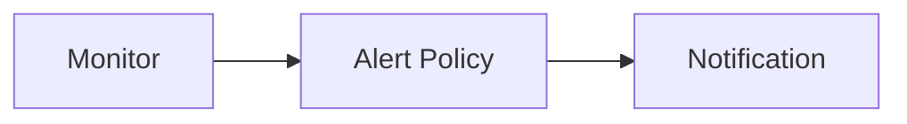

---
# generated by https://github.com/hashicorp/terraform-plugin-docs
page_title: "guance_monitor Resource - guance"
subcategory: ""
description: |-
  Monitor
  A monitor is a set of checks that you can run against your data. A monitor watches your data over time and alerts you
  when certain conditions are met. For example, you can create a monitor that watches the average response time of your
  website and alerts you when the response time is greater than 1 second.
  Monitors are made up of one or more checks. A check is a single test that you can run against your data. For example,
  you can create a check that watches the average response time of your website. You can also create a check that watches
  the percentage of 5xx errors in your logs.
  Guance Cloud supports defining monitors, users can customize the configuration of detection rules and trigger
  conditions, and open the monitors to receive related alarm events triggered by the detection rules.
  Relationships:
  ```mermaid
  graph LR
  A[Monitor] --> B[Alert Policy] --> C[Notification]
  ```
  Create
  The first let me create a resource. We will send the create operation to the resource management service
  ```terraform
  variable "email" {
    type = string
  }
  data "guance_members" "demo" {
    filters = [
      {
        name   = "email"
        values = [var.email]
      }
    ]
  }
  resource "guancemembergroup" "demo" {
    name       = "oac-demo"
    memberids = data.guance_members.demo.items[*].id
  }
  resource "guancealertpolicy" "demo" {
    name           = "oac-demo"
    silenttimeout = "1h"
  statuses = [
      "critical",
      "error",
      "warning",
      "info",
      "ok",
      "nodata",
      "nodataok",
      "nodataas_ok",
    ]
  alerttargets = [
      {
        type         = "membergroup"
        membergroup = {
          id = guancemembergroup.demo.id
        }
      },
    ]
  }
  resource "guancemonitor" "demo" {
    manifest     = file("${path.module}/monitor.json")
    alertpolicy = {
      id = guance_alertpolicy.demo.id
    }
  }
  ```
---

# guance_monitor (Resource)

# Monitor

A monitor is a set of checks that you can run against your data. A monitor watches your data over time and alerts you
when certain conditions are met. For example, you can create a monitor that watches the average response time of your
website and alerts you when the response time is greater than 1 second.

Monitors are made up of one or more checks. A check is a single test that you can run against your data. For example,
you can create a check that watches the average response time of your website. You can also create a check that watches
the percentage of 5xx errors in your logs.

Guance Cloud supports defining monitors, users can customize the configuration of detection rules and trigger
conditions, and open the monitors to receive related alarm events triggered by the detection rules.

Relationships:



## Create

The first let me create a resource. We will send the create operation to the resource management service

```terraform
variable "email" {
  type = string
}

data "guance_members" "demo" {
  filters = [
    {
      name   = "email"
      values = [var.email]
    }
  ]
}

resource "guance_membergroup" "demo" {
  name       = "oac-demo"
  member_ids = data.guance_members.demo.items[*].id
}

resource "guance_alertpolicy" "demo" {
  name           = "oac-demo"
  silent_timeout = "1h"

  statuses = [
    "critical",
    "error",
    "warning",
    "info",
    "ok",
    "nodata",
    "nodata_ok",
    "nodata_as_ok",
  ]

  alert_targets = [
    {
      type         = "member_group"
      member_group = {
        id = guance_membergroup.demo.id
      }
    },
  ]
}

resource "guance_monitor" "demo" {
  manifest     = file("${path.module}/monitor.json")
  alert_policy = {
    id = guance_alertpolicy.demo.id
  }
}
```


<!-- schema generated by tfplugindocs -->
## Schema

### Required

- `alert_policy` (Attributes) Alert Policy Configuration (see [below for nested schema](#nestedatt--alert_policy))
- `manifest` (String) Monitor Configuration

### Optional

- `dashboard` (Attributes) Dashboard Configuration (see [below for nested schema](#nestedatt--dashboard))

### Read-Only

- `created_at` (String) The RFC3339/ISO8601 time string of resource created at.
- `id` (String) The Guance Resource Name (GRN) of cloud resource.

<a id="nestedatt--alert_policy"></a>
### Nested Schema for `alert_policy`

Optional:

- `id` (String) Alert Policy ID


<a id="nestedatt--dashboard"></a>
### Nested Schema for `dashboard`

Optional:

- `id` (String) Dashboard ID


