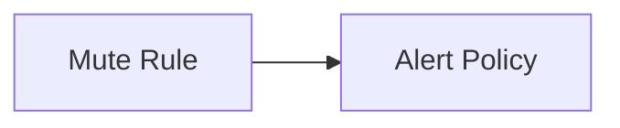

---
# generated by https://github.com/hashicorp/terraform-plugin-docs
page_title: "guance_mute Resource - guance"
subcategory: ""
description: |-
  Mute Rule
  Mute rule is a feature that allows you to temporarily stop receiving notifications for a specific alert. You can use
  mute rules to temporarily silence alerts that are not relevant to you, or to silence alerts that you are already aware
  of.
  Guance Cloud supports the management of all mute rules in the current workspace. It supports muting different monitors,
  smart inspections, self-built inspections, SLOs, and alert policies, so that the muted objects do not send any alert
  notifications to any alert notification objects during the mute time.
  Relationships:
  mermaid
  graph LR
      A[Mute Rule] --> B[Alert Policy]
  
  Create
  The first let me create a resource. We will send the create operation to the resource management service
  ```terraform
  variable "dingtalkwebhook" {
    type = string
  }
  variable "dingtalksecret" {
    type = string
  }
  variable "email" {
    type = string
  }
  data "guance_members" "demo" {
    filter = [
      {
        name   = "email"
        values = [var.email]
      }
    ]
  }
  resource "guancemembergroup" "demo" {
    name       = "oac-demo"
    memberids = data.guance_members.demo.items[*].id
  }
  resource "guancenotification" "demo" {
    name            = "oac-demo"
    type            = "dingtalkrobot"
    dingtalkrobot = {
      webhook = var.dingtalkwebhook
      secret  = var.dingtalk_secret
    }
  }
  resource "guancealertpolicy" "demo" {
    name           = "oac-demo"
    silenttimeout = "1h"
  statuses = [
      "critical",
      "error",
      "warning",
      "info",
      "ok",
      "nodata",
      "nodataok",
      "nodataas_ok",
    ]
  alerttargets = [
      {
        type         = "membergroup"
        membergroup = {
          id = guancemembergroup.demo.id
        }
      },
      {
        type         = "notification"
        notification = {
          id = guance_notification.demo.id
        }
      }
    ]
  }
  resource "guancemute" "demo" {
    // mute ranges
    muteranges = [
      {
        type = "alert_policy"
    alert_policy = {
      id = guance_alertpolicy.demo.id
    }
  }
  
  ]
  // notify options
    notify = {
      message = <<EOF
        Muted
      EOF
  before_time = "15m"
  
  }
  notifytargets = [
      {
        type = "membergroup"
    member_group = {
      id = guance_membergroup.demo.id
    }
  },
  {
    type = "notification"
  
    notification = {
      id = guance_notification.demo.id
    }
  }
  
  ]
  // ont-time options
    onetime = {
      start = "2022-08-04T12:00:00Z"
      end   = "2023-12-31T12:00:00Z"
    }
  // cron options
    repeat = {
      crontab_duration = "30s"
      start            = "05:00:00"
      end              = "10:00:00"
      expire           = "2023-12-31T12:00:00Z"
      crontab          = {
        min   = "0"
        hour  = "0"
        day   = ""
        month = ""
        week  = "*"
      }
    }
  mute_tags = [
      {
        key = "host"
        value = "*"
      }
    ]
  }
  ```
---

# guance_mute (Resource)

# Mute Rule

Mute rule is a feature that allows you to temporarily stop receiving notifications for a specific alert. You can use
mute rules to temporarily silence alerts that are not relevant to you, or to silence alerts that you are already aware
of.

Guance Cloud supports the management of all mute rules in the current workspace. It supports muting different monitors,
smart inspections, self-built inspections, SLOs, and alert policies, so that the muted objects do not send any alert
notifications to any alert notification objects during the mute time.

Relationships:



## Create

The first let me create a resource. We will send the create operation to the resource management service

```terraform
variable "ding_talk_webhook" {
  type = string
}

variable "ding_talk_secret" {
  type = string
}

variable "email" {
  type = string
}

data "guance_members" "demo" {
  filter = [
    {
      name   = "email"
      values = [var.email]
    }
  ]
}

resource "guance_membergroup" "demo" {
  name       = "oac-demo"
  member_ids = data.guance_members.demo.items[*].id
}

resource "guance_notification" "demo" {
  name            = "oac-demo"
  type            = "ding_talk_robot"
  ding_talk_robot = {
    webhook = var.ding_talk_webhook
    secret  = var.ding_talk_secret
  }
}

resource "guance_alertpolicy" "demo" {
  name           = "oac-demo"
  silent_timeout = "1h"

  statuses = [
    "critical",
    "error",
    "warning",
    "info",
    "ok",
    "nodata",
    "nodata_ok",
    "nodata_as_ok",
  ]

  alert_targets = [
    {
      type         = "member_group"
      member_group = {
        id = guance_membergroup.demo.id
      }
    },
    {
      type         = "notification"
      notification = {
        id = guance_notification.demo.id
      }
    }
  ]
}

resource "guance_mute" "demo" {
  // mute ranges
  mute_ranges = [
    {
      type = "alert_policy"

      alert_policy = {
        id = guance_alertpolicy.demo.id
      }
    }
  ]

  // notify options
  notify = {
    message = <<EOF
      Muted
    EOF

    before_time = "15m"
  }

  notify_targets = [
    {
      type = "member_group"

      member_group = {
        id = guance_membergroup.demo.id
      }
    },
    {
      type = "notification"

      notification = {
        id = guance_notification.demo.id
      }
    }
  ]

  // ont-time options
  onetime = {
    start = "2022-08-04T12:00:00Z"
    end   = "2023-12-31T12:00:00Z"
  }

  // cron options
  repeat = {
    crontab_duration = "30s"
    start            = "05:00:00"
    end              = "10:00:00"
    expire           = "2023-12-31T12:00:00Z"
    crontab          = {
      min   = "0"
      hour  = "0"
      day   = "*"
      month = "*"
      week  = "*"
    }
  }
  
  mute_tags = [
    {
      key = "host"
      value = "*"
    }
  ]
}
```


<!-- schema generated by tfplugindocs -->
## Schema

### Optional

- `mute_ranges` (Attributes List) Mute Ranges (see [below for nested schema](#nestedatt--mute_ranges))
- `mute_tags` (Attributes List) Tags (see [below for nested schema](#nestedatt--mute_tags))
- `notify` (Attributes) Notify Options (see [below for nested schema](#nestedatt--notify))
- `notify_targets` (Attributes List) Notify targets (see [below for nested schema](#nestedatt--notify_targets))
- `onetime` (Attributes) Onetime (see [below for nested schema](#nestedatt--onetime))
- `repeat` (Attributes) Repeat (see [below for nested schema](#nestedatt--repeat))

### Read-Only

- `created_at` (String) Timestamp of the last Terraform update of the order.
- `id` (String) Numeric identifier of the order.

<a id="nestedatt--mute_ranges"></a>
### Nested Schema for `mute_ranges`

Required:

- `type` (String) Mute Range Type

Optional:

- `alert_policy` (Attributes) Alert Policy configuration (see [below for nested schema](#nestedatt--mute_ranges--alert_policy))
- `monitor` (Attributes) Monitor configuration (see [below for nested schema](#nestedatt--mute_ranges--monitor))

<a id="nestedatt--mute_ranges--alert_policy"></a>
### Nested Schema for `mute_ranges.alert_policy`

Required:

- `id` (String) Alert Policy ID


<a id="nestedatt--mute_ranges--monitor"></a>
### Nested Schema for `mute_ranges.monitor`

Required:

- `id` (String) Monitor ID


<a id="nestedatt--mute_tags"></a>
### Nested Schema for `mute_tags`

Required:

- `key` (String) Tag
- `value` (String) Tag Value


<a id="nestedatt--notify"></a>
### Nested Schema for `notify`

Optional:

- `before_time` (String) Notify Time
- `message` (String) Notify Message


<a id="nestedatt--notify_targets"></a>
### Nested Schema for `notify_targets`

Required:

- `type` (String) Notify Type

Optional:

- `member_group` (Attributes) MemberGroup (see [below for nested schema](#nestedatt--notify_targets--member_group))
- `notification` (Attributes) Notification (see [below for nested schema](#nestedatt--notify_targets--notification))

<a id="nestedatt--notify_targets--member_group"></a>
### Nested Schema for `notify_targets.member_group`

Required:

- `id` (String) MemberGroup ID


<a id="nestedatt--notify_targets--notification"></a>
### Nested Schema for `notify_targets.notification`

Required:

- `id` (String) Notification ID


<a id="nestedatt--onetime"></a>
### Nested Schema for `onetime`

Optional:

- `end` (String) End
- `start` (String) Start


<a id="nestedatt--repeat"></a>
### Nested Schema for `repeat`

Optional:

- `crontab` (Attributes) Crontab configuration (see [below for nested schema](#nestedatt--repeat--crontab))
- `crontab_duration` (String) Crontab Duration
- `end` (String) End
- `expire` (String) Repeat Expire
- `start` (String) Start

<a id="nestedatt--repeat--crontab"></a>
### Nested Schema for `repeat.crontab`

Optional:

- `day` (String) Day
- `hour` (String) Hour
- `min` (String) Min
- `month` (String) Month
- `week` (String) Week


