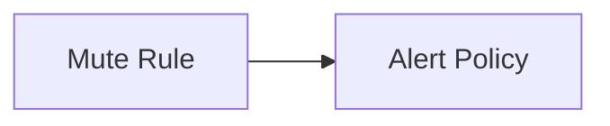

---
# generated by https://github.com/hashicorp/terraform-plugin-docs
page_title: "guance_mute Resource - guance"
subcategory: ""
description: |-
  Mute rule is a feature that allows you to temporarily stop receiving notifications for a specific alert. You can use mute rules to temporarily silence alerts that are not relevant to you, or to silence alerts that you are already aware of.
  Guance Cloud supports the management of all mute rules in the current workspace. It supports muting different monitors, smart inspections, self-built inspections, SLOs, and alert policies, so that the muted objects do not send any alert notifications to any alert notification objects during the mute time.
  Relationships:
  mermaid
  graph LR
      A[Mute Rule] --> B[Alert Policy]
---

# guance_mute (Resource)

Mute rule is a feature that allows you to temporarily stop receiving notifications for a specific alert. You can use mute rules to temporarily silence alerts that are not relevant to you, or to silence alerts that you are already aware of.

Guance Cloud supports the management of all mute rules in the current workspace. It supports muting different monitors, smart inspections, self-built inspections, SLOs, and alert policies, so that the muted objects do not send any alert notifications to any alert notification objects during the mute time.

Relationships:

<!-- schema generated by tfplugindocs -->
## Schema

### Optional

- `end` (Number) End
- `mute_ranges` (List of String) Mute Ranges
- `notify` (Attributes) Notify Options (see [below for nested schema](#nestedatt--notify))
- `repeat` (Attributes) Repeat (see [below for nested schema](#nestedatt--repeat))
- `start` (Number) Start
- `tags` (Attributes) Tags (see [below for nested schema](#nestedatt--tags))

### Read-Only

- `created_at` (String) Timestamp of the last Terraform update of the order.
- `id` (String) Numeric identifier of the order.

### Nested Schema for `notify`

Optional:

- `message` (String) Notify Message
- `targets` (Attributes List) Notify Targets (see [below for nested schema](#nestedatt--notify--targets))
- `time` (Number) Notify Time

### Nested Schema for `notify.targets`

Required:

- `to` (String) Notify Target
- `type` (String) Notify Type

### Nested Schema for `repeat`

Optional:

- `crontab` (Attributes) Repeat Crontab Set (see [below for nested schema](#nestedatt--repeat--crontab))
- `crontab_duration` (Number) Crontab Duration
- `expire` (Number) Repeat Expire
- `time` (Number) Repeat Time Set

### Nested Schema for `repeat.crontab`

Optional:

- `day` (String) Day
- `hour` (String) Hour
- `min` (String) Min
- `month` (String) Month
- `week` (String) Week

### Nested Schema for `tags`

Required:

- `key` (String) <no value>
- `value` (String) <no value>

