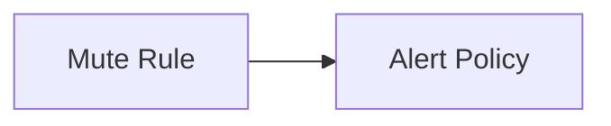

---
# generated by https://github.com/hashicorp/terraform-plugin-docs
page_title: "guance_mute Resource - guance"
subcategory: ""
description: |-
  Mute rule is a feature that allows you to temporarily stop receiving notifications for a specific alert. You can use mute rules to temporarily silence alerts that are not relevant to you, or to silence alerts that you are already aware of.
  Guance Cloud supports the management of all mute rules in the current workspace. It supports muting different monitors, smart inspections, self-built inspections, SLOs, and alert policies, so that the muted objects do not send any alert notifications to any alert notification objects during the mute time.
  Relationships:
  mermaid
  graph LR
      A[Mute Rule] --> B[Alert Policy]
---

# guance_mute (Resource)

Mute rule is a feature that allows you to temporarily stop receiving notifications for a specific alert. You can use mute rules to temporarily silence alerts that are not relevant to you, or to silence alerts that you are already aware of.

Guance Cloud supports the management of all mute rules in the current workspace. It supports muting different monitors, smart inspections, self-built inspections, SLOs, and alert policies, so that the muted objects do not send any alert notifications to any alert notification objects during the mute time.

Relationships:

<!-- schema generated by tfplugindocs -->
## Schema

### Optional

- `mute_ranges` (Attributes List) Mute Ranges (see [below for nested schema](#nestedatt--mute_ranges))
- `notify` (Attributes) Notify Options (see [below for nested schema](#nestedatt--notify))
- `notify_targets` (Attributes List) Notify targets (see [below for nested schema](#nestedatt--notify_targets))
- `onetime` (Attributes) Onetime (see [below for nested schema](#nestedatt--onetime))
- `repeat` (Attributes) Repeat (see [below for nested schema](#nestedatt--repeat))

### Read-Only

- `created_at` (String) Timestamp of the last Terraform update of the order.
- `id` (String) Numeric identifier of the order.

### Nested Schema for `mute_ranges`

Required:

- `type` (String) Mute Range Type

Optional:

- `alert_policy` (Attributes) Alert Policy configuration (see [below for nested schema](#nestedatt--mute_ranges--alert_policy))
- `monitor` (Attributes) Monitor configuration (see [below for nested schema](#nestedatt--mute_ranges--monitor))

### Nested Schema for `mute_ranges.alert_policy`

Required:

- `id` (String) Alert Policy ID

### Nested Schema for `mute_ranges.monitor`

Required:

- `id` (String) Monitor ID

### Nested Schema for `notify`

Optional:

- `before_time` (String) Notify Time
- `message` (String) Notify Message

### Nested Schema for `notify_targets`

Required:

- `type` (String) Notify Type

Optional:

- `member_group` (Attributes) MemberGroup (see [below for nested schema](#nestedatt--notify_targets--member_group))
- `notification` (Attributes) Notification (see [below for nested schema](#nestedatt--notify_targets--notification))

### Nested Schema for `notify_targets.member_group`

Required:

- `id` (String) MemberGroup ID

### Nested Schema for `notify_targets.notification`

Required:

- `id` (String) Notification ID

### Nested Schema for `onetime`

Optional:

- `end` (String) End
- `start` (String) Start

### Nested Schema for `repeat`

Optional:

- `crontab` (Attributes) Repeat Crontab Set (see [below for nested schema](#nestedatt--repeat--crontab))
- `crontab_duration` (String) Crontab Duration
- `end` (String) End
- `expire` (String) Repeat Expire
- `start` (String) Start

### Nested Schema for `repeat.crontab`

Optional:

- `day` (String) Day
- `hour` (String) Hour
- `min` (String) Min
- `month` (String) Month
- `week` (String) Week

