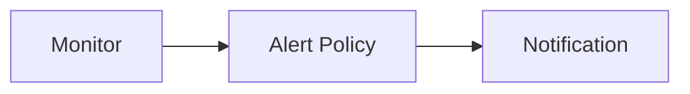

---
# generated by https://github.com/hashicorp/terraform-plugin-docs
page_title: "guance_notification Resource - guance"
subcategory: ""
description: |-
  Notification
  Notification is a feature that allows you to receive alerts when an event occurs.
  Guance Cloud supports setting the notification object for the alert event. When the alert event occurs, the alert
  information will be sent to the notification object.
  Guance Cloud supports multiple different notification methods. You can refer to the documentation to learn more.
  Relationships:
  ```mermaid
  graph LR
  A[Monitor] --> B[Alert Policy] --> C[Notification]
  ```
  Create
  The first let me create a resource. We will send the create operation to the resource management service
  ```terraform
  variable "dingtalkwebhook" {
    type = string
  }
  variable "dingtalksecret" {
    type = string
  }
  resource "guancenotification" "demo" {
    name            = "oac-demo"
    type            = "dingtalkrobot"
    dingtalkrobot = {
      webhook = var.dingtalkwebhook
      secret  = var.dingtalk_secret
    }
  }
  ```
---

# guance_notification (Resource)

# Notification

Notification is a feature that allows you to receive alerts when an event occurs.

Guance Cloud supports setting the notification object for the alert event. When the alert event occurs, the alert
information will be sent to the notification object.

Guance Cloud supports multiple different notification methods. You can refer to the documentation to learn more.

Relationships:



## Create

The first let me create a resource. We will send the create operation to the resource management service

```terraform
variable "ding_talk_webhook" {
  type = string
}

variable "ding_talk_secret" {
  type = string
}

resource "guance_notification" "demo" {
  name            = "oac-demo"
  type            = "ding_talk_robot"
  ding_talk_robot = {
    webhook = var.ding_talk_webhook
    secret  = var.ding_talk_secret
  }
}
```


<!-- schema generated by tfplugindocs -->
## Schema

### Required

- `name` (String) Notification object name
- `type` (String) Trigger rule type, value must be one of: *ding_talk_robot*, *http_request*, *wechat_robot*, *mail_group*, *feishu_robot*, *sms*, other value will be ignored.

### Optional

- `ding_talk_robot` (Attributes) DingTalk Robot (see [below for nested schema](#nestedatt--ding_talk_robot))
- `feishu_robot` (Attributes) Feishu Robot (see [below for nested schema](#nestedatt--feishu_robot))
- `http_request` (Attributes) HTTP Request (see [below for nested schema](#nestedatt--http_request))
- `mail_group` (Attributes) Mail Group (see [below for nested schema](#nestedatt--mail_group))
- `sms` (Attributes) SMS (see [below for nested schema](#nestedatt--sms))
- `wechat_robot` (Attributes) WeChat Robot (see [below for nested schema](#nestedatt--wechat_robot))

### Read-Only

- `created_at` (String) The RFC3339/ISO8601 time string of resource created at.
- `id` (String) The Guance Resource Name (GRN) of cloud resource.

<a id="nestedatt--ding_talk_robot"></a>
### Nested Schema for `ding_talk_robot`

Required:

- `secret` (String) DingTalk Robot Call Secret
- `webhook` (String) DingTalk Robot Call Address


<a id="nestedatt--feishu_robot"></a>
### Nested Schema for `feishu_robot`

Required:

- `secret` (String) Feishu Robot Call Secret
- `webhook` (String) Feishu Robot Call Address


<a id="nestedatt--http_request"></a>
### Nested Schema for `http_request`

Required:

- `url` (String) HTTP Call Address


<a id="nestedatt--mail_group"></a>
### Nested Schema for `mail_group`

Required:

- `to` (List of String) Member Account List


<a id="nestedatt--sms"></a>
### Nested Schema for `sms`

Required:

- `to` (List of String) Phone Number List


<a id="nestedatt--wechat_robot"></a>
### Nested Schema for `wechat_robot`

Required:

- `webhook` (String) Robot Call Address


