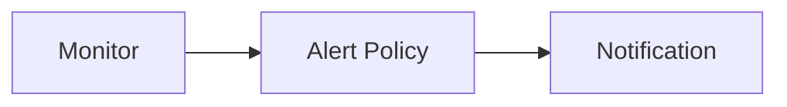

# Alert Policy

Alert policy is a set of rules that define when to trigger an alert. You can create alert policies for your data
sources, and set up alert targets to receive alerts.

Guance Cloud supports alert policy management for the results of monitor checks, by sending alert notification emails or
group message notifications, so that you can know about the abnormal data situation of the monitoring in time, find
problems, and solve problems.

Relationships:



Notes:

1. When a monitor is created, an alert policy must be selected, and the default is selected by default;
2. When a certain alert policy is deleted, the monitor under the deleted alert policy will automatically be classified
   into the default.

## Create

The first let me create a resource. We will send the create operation to the resource management service

```terraform
variable "ding_talk_webhook" {
  type = string
}

variable "ding_talk_secret" {
  type = string
}

variable "email" {
  type = string
}

data "guance_members" "demo" {
  filters = [
    {
      name   = "email"
      values = [var.email]
    }
  ]
}

resource "guance_membergroup" "demo" {
  name       = "oac-demo"
  member_ids = data.guance_members.demo.items[*].id
}

resource "guance_notification" "demo" {
  name            = "oac-demo"
  type            = "ding_talk_robot"
  ding_talk_robot = {
    webhook = var.ding_talk_webhook
    secret  = var.ding_talk_secret
  }
}

resource "guance_alertpolicy" "demo" {
  name           = "oac-demo"
  silent_timeout = "1h"

  statuses = [
    "critical",
    "error",
    "warning",
    "info",
    "ok",
    "nodata",
    "nodata_ok",
    "nodata_as_ok",
  ]

  alert_targets = [
    {
      type         = "member_group"
      member_group = {
        id = guance_membergroup.demo.id
      }
    },
    {
      type         = "notification"
      notification = {
        id = guance_notification.demo.id
      }
    }
  ]
}
```
