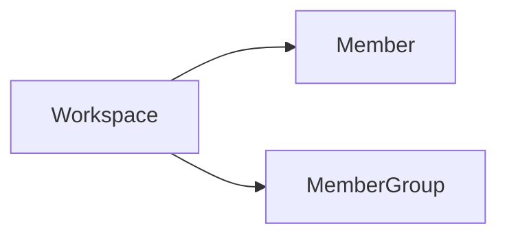

# Member Group

Member group is a collection of members in a workspace, and member groups can be authorized to access the resources in
the workspace.

Member group is an abstract concept, it can be a team, or a department, it can help us build a reasonable organizational
structure, optimize the management efficiency and user experience of the observability platform.

Relationships:



## Create

The first let me create a resource. We will send the create operation to the resource management service

```terraform
variable "email" {
  type = string
}

data "guance_members" "demo" {
  filters = [
    {
      name   = "email"
      values = [var.email]
    }
  ]
}

resource "guance_membergroup" "demo" {
  name       = "oac-demo"
  member_ids = data.guance_members.demo.items[*].id
}
```
