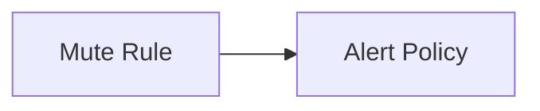

# Mute Rule

Mute rule is a feature that allows you to temporarily stop receiving notifications for a specific alert. You can use
mute rules to temporarily silence alerts that are not relevant to you, or to silence alerts that you are already aware
of.

Guance Cloud supports the management of all mute rules in the current workspace. It supports muting different monitors,
smart inspections, self-built inspections, SLOs, and alert policies, so that the muted objects do not send any alert
notifications to any alert notification objects during the mute time.

Relationships:



## Create

The first let me create a resource. We will send the create operation to the resource management service

```terraform
variable "ding_talk_webhook" {
  type = string
}

variable "ding_talk_secret" {
  type = string
}

variable "email" {
  type = string
}

data "guance_members" "demo" {
  filters = [
    {
      name   = "email"
      values = [var.email]
    }
  ]
}

resource "guance_membergroup" "demo" {
  name       = "oac-demo"
  member_ids = data.guance_members.demo.items[*].id
}

resource "guance_notification" "demo" {
  name            = "oac-demo"
  type            = "ding_talk_robot"
  ding_talk_robot = {
    webhook = var.ding_talk_webhook
    secret  = var.ding_talk_secret
  }
}

resource "guance_alertpolicy" "demo" {
  name           = "oac-demo"
  silent_timeout = "1h"

  statuses = [
    "critical",
    "error",
    "warning",
    "info",
    "ok",
    "nodata",
    "nodata_ok",
    "nodata_as_ok",
  ]

  alert_targets = [
    {
      type         = "member_group"
      member_group = {
        id = guance_membergroup.demo.id
      }
    },
    {
      type         = "notification"
      notification = {
        id = guance_notification.demo.id
      }
    }
  ]
}

resource "guance_mute" "demo" {
  // mute ranges
  mute_ranges = [
    {
      type = "alert_policy"

      alert_policy = {
        id = guance_alertpolicy.demo.id
      }
    }
  ]

  // notify options
  notify = {
    message = <<EOF
      Muted
    EOF

    before_time = "15m"
  }

  notify_targets = [
    {
      type = "member_group"

      member_group = {
        id = guance_membergroup.demo.id
      }
    },
    {
      type = "notification"

      notification = {
        id = guance_notification.demo.id
      }
    }
  ]

  // ont-time options
  onetime = {
    start = "2022-08-04T12:00:00Z"
    end   = "2023-12-31T12:00:00Z"
  }

  // cron options
  repeat = {
    crontab_duration = "30s"
    start            = "05:00:00"
    end              = "10:00:00"
    expire           = "2023-12-31T12:00:00Z"
    crontab          = {
      min   = "0"
      hour  = "0"
      day   = "*"
      month = "*"
      week  = "*"
    }
  }

  mute_tags = [
    {
      key   = "host"
      value = "*"
    }
  ]
}
```
