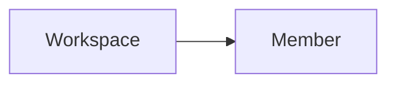

A workspace member is a user who has access to a workspace.

Guance Cloud supports managing all members of the current workspace through member management, including setting role permissions, inviting members and setting permissions for members, configuring member groups, and setting SSO single sign-on.

Relationships:

