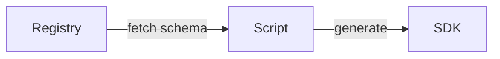

Resource Schema is the core of semantic API. You can discover all the resource by resource schema.

The typically usage is:

* If you are the third-party vendor, you can create your integration page by schema
* If you need the SDK we haven't published, you can create your own SDK by resource schema

