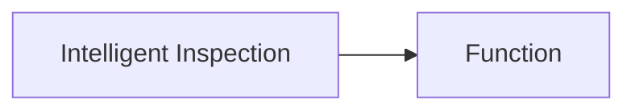

Intelligent inspection is a feature that allows you to automatically detect abnormality in the system and trigger alarms. It is based on the concept of anomaly detection, which is a time series analysis technique that can detect anomalies in the system based on historical data.

Guance Cloud supports custom intelligent inspection through Function. Based on intelligent algorithms, it automatically detects infrastructure and application problems to help users find problems that have already occurred and potential problems in the process of IT system operation. Through root cause analysis, it can quickly locate the cause of abnormal problems.

Relationships:

