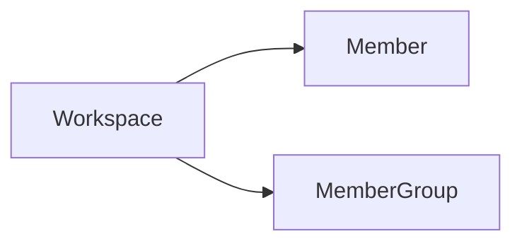

Member group is a collection of members in a workspace, and member groups can be authorized to access the resources in the workspace.

Member group is an abstract concept, it can be a team, or a department, it can help us build a reasonable organizational structure, optimize the management efficiency and user experience of the observability platform.

Relationships:

