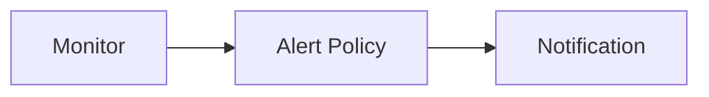

A monitor is a set of checks that you can run against your data. A monitor watches your data over time and alerts you when certain conditions are met. For example, you can create a monitor that watches the average response time of your website and alerts you when the response time is greater than 1 second.

Monitors are made up of one or more checks. A check is a single test that you can run against your data. For example, you can create a check that watches the average response time of your website. You can also create a check that watches the percentage of 5xx errors in your logs.

Guance Cloud supports defining monitors, users can customize the configuration of detection rules and trigger conditions, and open the monitors to receive related alarm events triggered by the detection rules.

Relationships:

