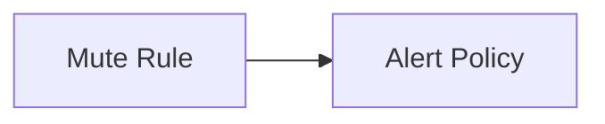

Mute rule is a feature that allows you to temporarily stop receiving notifications for a specific alert. You can use mute rules to temporarily silence alerts that are not relevant to you, or to silence alerts that you are already aware of.

Guance Cloud supports the management of all mute rules in the current workspace. It supports muting different monitors, smart inspections, self-built inspections, SLOs, and alert policies, so that the muted objects do not send any alert notifications to any alert notification objects during the mute time.

Relationships:

