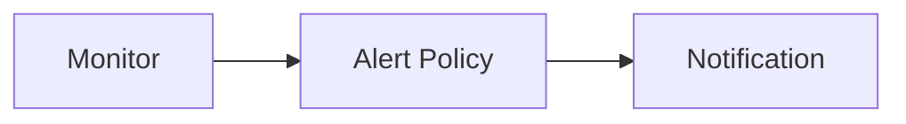

Notification is a feature that allows you to receive alerts when an event occurs.

Guance Cloud supports setting the notification object for the alert event. When the alert event occurs, the alert information will be sent to the notification object.

Guance Cloud supports multiple different notification methods. You can refer to the documentation to learn more.

Relationships:

